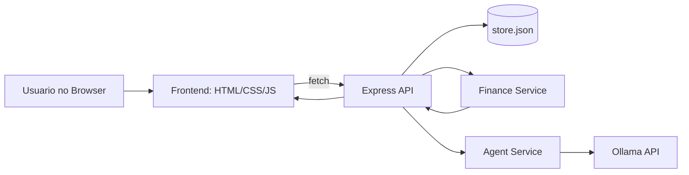

# Pulse Finance

Aplicacao web de controle financeiro pessoal com foco em:
- velocidade de uso no dia a dia
- visual moderno
- analise real de gastos
- assistente de IA conectado aos dados do proprio app

<p>
  
  
  
  
  
</p>

---

## Sumario
- [Visao Geral](#visao-geral)
- [Principais Recursos](#principais-recursos)
- [Arquitetura](#arquitetura)
- [Tecnologias](#tecnologias)
- [Como Rodar](#como-rodar)
- [Assistente com IA (Ollama)](#assistente-com-ia-ollama)
- [Variaveis de Ambiente](#variaveis-de-ambiente)
- [Deploy na Vercel](#deploy-na-vercel)
- [API REST](#api-rest)
- [Estrutura de Pastas](#estrutura-de-pastas)
- [Documentacao de Estudo](#documentacao-de-estudo)
- [Roadmap](#roadmap)
- [Troubleshooting](#troubleshooting)

---

## Visao Geral
O Pulse Finance e uma aplicacao fullstack que roda em uma unica porta:
- o **backend Express** expoe uma API REST
- o **frontend estatico** e servido pelo proprio backend
- os dados sao persistidos em `backend/data/store.json`

Fluxo principal:
1. Usuario registra e gerencia gastos.
2. Backend valida, persiste e calcula indicadores.
3. Frontend atualiza cards, historico e graficos.
4. Assistente IA responde usando tools ligadas aos dados reais.

---

## Principais Recursos
- Dashboard com totais de hoje, semana e mes.
- Historico com filtros por categoria, periodo, busca e ordenacao.
- Cadastro, edicao e exclusao de gastos.
- Controle de meta mensal com barra de progresso e alertas.
- Controle de saldo inicial e saldo atual da conta.
- Visao analitica com graficos e highlights automaticos.
- Assistente Financeira com chat real:
  - `POST /api/agent/chat`
  - memoria por sessao
  - tool calling para consultar resumo, meta, conta e lista de gastos.

---

## Arquitetura


---

## Tecnologias
- **Backend:** Node.js, Express
- **Frontend:** HTML, CSS, JavaScript (Vanilla)
- **Graficos:** Chart.js
- **Persistencia:** JSON file (`store.json`)
- **IA local/cloud via Ollama:** modelo padrao `gpt-oss:20b-cloud`

---

## Como Rodar
### 1) Pre-requisitos
- Node.js 18+
- npm
- Ollama instalado (para usar o chat IA)

### 2) Instalar dependencias
```bash
cd backend
npm install
```

### 3) Subir aplicacao
```bash
cd backend
npm run dev
```

Abra no navegador:
```text
http://localhost:3000
```

---

## Assistente com IA (Ollama)
O backend ja vem pronto para usar IA:
- tenta iniciar `ollama serve` automaticamente se necessario
- tenta baixar o modelo configurado se ele nao existir

Modelo padrao:
```text
gpt-oss:20b-cloud
```

Se quiser preparar manualmente:
```bash
ollama pull gpt-oss:20b-cloud
ollama run gpt-oss:20b-cloud
```

Exemplo de chamada:
```bash
curl -X POST http://localhost:3000/api/agent/chat \
  -H "Content-Type: application/json" \
  -d "{\"sessionId\":\"meu-chat\",\"message\":\"Quanto ja gastei este mes?\"}"
```

Exemplo de resposta:
```json
{
  "sessionId": "meu-chat",
  "model": "gpt-oss:20b-cloud",
  "usedTools": ["get_summary"],
  "reply": "Voce gastou ..."
}
```

---

## Variaveis de Ambiente
| Variavel | Padrao | Descricao |
|---|---|---|
| `PORT` | `3000` | Porta do servidor Express |
| `OLLAMA_BASE_URL` | `http://127.0.0.1:11434` | URL da API Ollama |
| `OLLAMA_MODEL` | `gpt-oss:20b-cloud` | Modelo usado pelo agente |
| `OLLAMA_TIMEOUT_MS` | `45000` | Timeout para chamada de chat |
| `OLLAMA_PULL_TIMEOUT_MS` | `120000` | Timeout para download do modelo |
| `OLLAMA_READY_TIMEOUT_MS` | `20000` | Timeout para aguardar Ollama subir |
| `OLLAMA_API_KEY` | vazio | Token Bearer opcional para endpoint Ollama remoto |
| `OLLAMA_AUTO_START` | `true` local / `false` serverless | Tenta iniciar `ollama serve` automaticamente |
| `OLLAMA_SKIP_MODEL_CHECK` | `false` local / `true` serverless | Pula validacao/download do modelo |
| `DATA_FILE_PATH` | `backend/data/store.json` local / `/tmp/pulse-finance-store.json` na Vercel | Caminho do arquivo de persistencia |

---

## Deploy na Vercel
Este repositorio agora possui `vercel.json` para:
- servir `frontend/` como site estatico
- rotear `GET/POST/PUT/DELETE /api/*` para `backend/src/server.js`

Pontos importantes em producao:
1. **Ollama local nao funciona em serverless.**
   - Na Vercel, configure `OLLAMA_BASE_URL` com endpoint publico (nao `localhost`).
   - Se o endpoint exigir token, configure `OLLAMA_API_KEY`.
2. **Persistencia em arquivo no serverless e limitada.**
   - O padrao usa `/tmp/pulse-finance-store.json` para evitar erro de permissao.
   - `/tmp` nao substitui banco de dados persistente; para dados de producao, migre para banco externo.

---

## API REST
### Categorias
- `GET /api/categories` - lista categorias

### Gastos
- `GET /api/expenses` - lista gastos (com filtros/query params)
- `POST /api/expenses` - cria gasto
- `PUT /api/expenses/:id` - atualiza gasto
- `DELETE /api/expenses/:id` - remove gasto

### Resumo e controle
- `GET /api/summary` - totais e dados de dashboard
- `GET /api/goal` - status da meta mensal
- `PUT /api/goal` - atualiza meta mensal
- `GET /api/account` - status da conta
- `PUT /api/account` - atualiza saldo inicial
- `GET /api/analytics` - dados de graficos e insights

### Assistente IA
- `POST /api/agent/chat` - conversa com agente financeiro
- `DELETE /api/agent/session/:sessionId` - limpa memoria de sessao

---

## Estrutura de Pastas
```text
pulse-finance/
  backend/
    data/
      store.json
    src/
      agentService.js
      dataStore.js
      financeService.js
      server.js
      validation.js
    package.json
  frontend/
    assets/
      styles.css
    js/
      api.js
      app.js
      charts.js
      state.js
    index.html
  study/
    01_arquitetura_fluxo_geral.md
    02_frontend_interface_estado.md
    03_backend_api_persistencia.md
  README.md
```

---

## Documentacao de Estudo
A pasta `study/` traz conteudo didatico sobre:
- arquitetura geral e fluxo front/back
- funcionamento do frontend (estado, eventos, renderizacao)
- funcionamento do backend (API, validacoes, persistencia)

---

## Roadmap
- Persistir historico de chat no backend (hoje e em RAM).
- Suportar registro de gasto por linguagem natural com confirmacao.
- Cobertura de testes automatizados para API e fluxo do agente.
- Opcional: migracao de persistencia JSON para banco de dados.

---

## Troubleshooting
### O chat nao responde
1. Verifique se o backend esta rodando (`npm run dev` em `backend`).
2. Verifique se o Ollama esta instalado e acessivel.
3. Teste a API do Ollama:
   - `http://127.0.0.1:11434/api/tags`
4. Se necessario, execute manualmente:
   - `ollama run gpt-oss:20b-cloud`
5. Em deploy Vercel:
   - nao use `OLLAMA_BASE_URL` apontando para `localhost`
   - configure um endpoint Ollama remoto

### Porta 3000 ocupada
Defina outra porta:
```bash
# Linux/macOS
PORT=3001 npm run dev

# PowerShell
$env:PORT=3001; npm run dev
```

### A API de gastos falha na Vercel
1. Verifique se o deploy inclui o `vercel.json` na raiz.
2. Confirme que `DATA_FILE_PATH` esta configurado para um caminho gravavel (ex: `/tmp/pulse-finance-store.json`).
3. Lembre que `/tmp` e temporario; para persistencia de verdade em producao, use banco externo.

---

Se esse projeto te ajudou ou te inspirou, um star no repositorio sempre ajuda.
